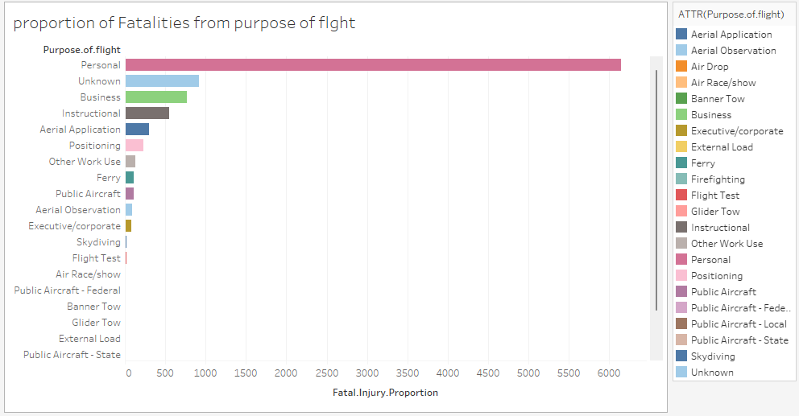
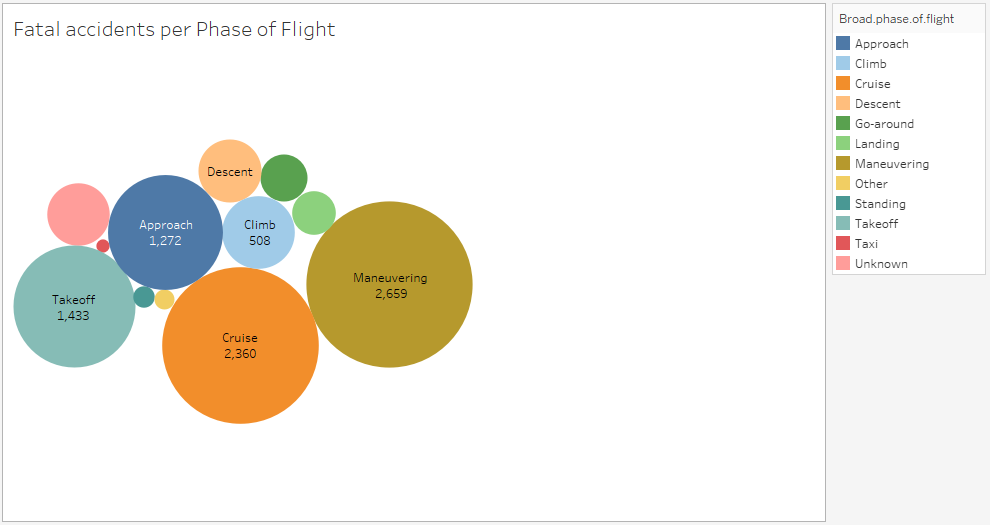
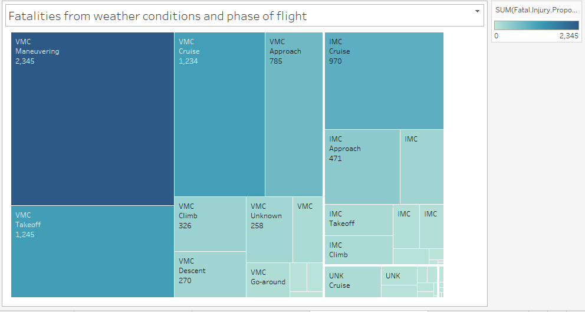
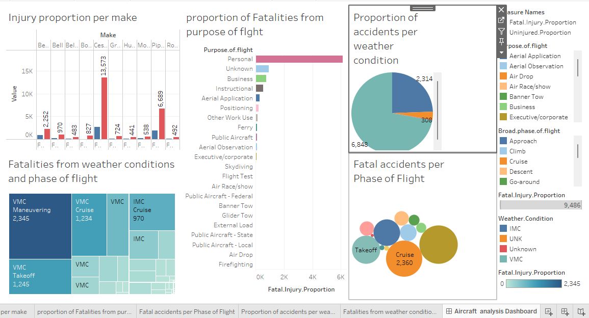

# Business Understanding

**Background**
As part of our strategic initiative to diversify our company's portfolio, we are venturing into the aviation industry. This expansion involves purchasing and operating airplanes for commercial enterprises. Given the high stakes associated with aviation, understanding the potential risks and ensuring the highest standards of safety is paramount for the success of this new business endeavor.

I Edwin Maina ,a data scientist at QWERTY company ltd was tasked with performing thorough research and analysis assessing aircraft safety through historical accident trends to identify aircraft makes and models with the least incidence of accidents. Delivering key recommendations for strategic aircraft purchases.This project seeks to minimize operational risks and enhance decision-making when purchasing and operating aircraft.

**PROBLEM STATEMENT**;
Our company is expanding its portfolio into the aviation industry but lacks knowledge of the risks associated with purchasing and operating aircraft for commercial and private operations. We need to identify which aircraft present the lowest risk at reasonable cost and succesful entry to the market to make good investment decisions. 

**Objective**;
identify the aircraft models that present the lowest risk in terms of safety and operational reliability. This involves a comprehensive analysis of the provided dataset to evaluate the safety performance of various aircraft manufacturers and models. 
The goal is to provide insights that will guide the decision-making process for the acquisition of aircraft, ensuring that we select models with proven safety records.

**Key Stakeholders**: Company stakeholders,potential investors
Government policy makers, competiting airline businesses and customers

**Success Criteria**: succesful entry to the aviation industry with completion of purchase of a low risk aircarft 
with good return on investment

# Data Understanding
Source of data

The dataset for this analysis comes from the National Transportation Safety Board (NTSB) and contains information on aviation accidents and selected incidents involving civil aviation in the United States and international waters. The data spans from 1948 to 2022 and includes various details related to accident occurrences, the purpose of the flight, the aircraft involved, and weather conditions at the time of the incidents.
Description of Data

The dataset contains 90,348 records with 31 columns, covering various aspects of aviation accidents, including:

Event Date: The date when the aviation accident or incident occurred.
Location: The geographic location where the incident took place.
Aircraft Make and Model: The manufacturer and specific model of the aircraft involved in the accident.
Broad Phase of Flight: The general phase of flight during which the accident occurred. This includes stages such as: 
Aircraft Damage: Details about the severity of the aircraft damage (e.g., Destroyed, Substantial, Minor, Unknown).
Weather Conditions: Information on the weather conditions at the time of the incident.
Engine Type: The type of the engine in the aircraft (e.g, Reciprocating, Turbo Fan, Turbo shaft, Turbo Prop)
Number of engines: The number of the engine per aircraft
Purpose of flight ( personal, instructional, business)
Total Fatal Injuries: The total number of fatalities resulting from the accident.
Total Serious Injuries: The total number of serious injuries (non-fatal) resulting from the accident.
Total Minor Injuries: The total number of minor injuries resulting from the accident.

# Data Cleaning Process

Ensuring the quality and consistency of our data is paramount. I undertook the following data cleaning steps to prepare the dataset for analysis:

Checking for Duplicates: My first step was to check for duplicate values in the dataset. Ensuring the uniqueness of our records is crucial to avoid skewed results. This check however found that the dataset does not contain any duplicate entries.

In this analysis, I aim to focus on the most relevant data to enable making of informed recommendations. As such, I have decided to perform data reduction by dropping certain columns from this dataset. This step will simplify our data and make it easier to handle, without losing the information that is crucial to our analysis.

# Visualizations

**Injury proportion per make**

Comparing fatal injury proportion to uninjured proportion for top 10 aircraft manufacturers by make. Cessna has the highest total, with a large proportion of uninjured occupants.

**Proportion of Fatalities from purpose of flight**

Personal flights have the highest fatality count, followed by Unknown and Business purposes.
Offering flights with low-risk of fatalities is a better investment

**Fatal accidents per Phase of Flight**

This Illustrates number of fatal accidents for each flight phase. Bubble size corresponds to number of accidents. Maneuvering, Cruise, and Approach are the largest bubbles.pilots sholud be trained extensively on how to handle the aircraft in these situations.

**Fatalities from weather conditions and phase of flight**

This treemap displays fatalities broken down by weather conditions (VMC/IMC) and flight phases (e.g., Maneuvering, Cruise, Approach).

Key observations:
- VMC (Visual Meteorological Conditions) Maneuvering has the largest number of fatalities
- VMC conditions generally show higher fatality numbers across different flight phases
- Cruise and Approach phases also show significant fatalities in both VMC and IMC conditions

# Recommendations

# References
Presentation pdf 
**Tableau Visualisation** : 
